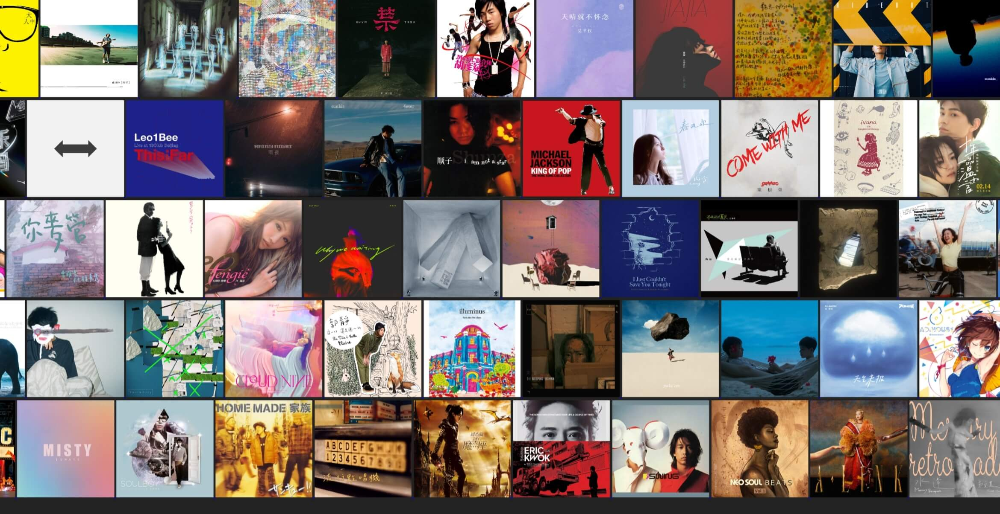

# 创建流动的CD墙作为壁纸

## 项目描述
本项目能够从指定QQ音乐播放列表生成一个html页面，该页面会显示一个流动的CD墙，CD墙中的CD会不断的流动，配合[Lively](https://www.rocksdanister.com/lively/)可以将此页面设置为桌面壁纸。



## 配置
```bash
pip install -r requirements.txt
```

## 运行
### 生成封面文件夹与封面列表
我们需要先生成一个封面文件夹，该文件夹中包含了所有专辑封面图片。然后生成一个封面列表文件，该文件中包含了封面文件夹中所有封面的文件名。
可以通过两种方式生成封面文件夹与封面列表文件，一种是从QQ音乐播放列表构建，另一种是从网易云音乐播放列表构建，下面分别介绍。

#### 从QQ音乐播放列表构建

一般在QQ音乐网页版中，点击播放列表，然后复制浏览器地址栏中的地址即可得到播放列表ID。
找到你的QQ音乐播放列表ID，例如`https://y.qq.com/n/yqq/playlist/8081238754.html`中的`8081238754`就是播放列表ID。
```bash
python download_qqmusic_playlist.py --playlist_id 8081238754 --cover_dir covers
```

下载QQ音乐播放列表`8081238754`中所有歌曲的专辑封面到`covers`文件夹中，`--cover_dir`参数指定封面文件夹。

同时会生成一个`covers.json`文件，该文件中包含了封面文件夹中所有封面的文件名。这是为了方便后续生成CD墙HTML。

#### 从网易云音乐播放列表构建（TODO）


### 生成CD墙 HTML

```bash
python generate_cd_wall.py --cover_dir covers --output_dir html --cover_list covers.json
```
cover_dir参数指定封面文件夹，cover_list参数指定封面列表文件，output_dir参数指定输出文件夹。

cover_list文件是上一步生成的`covers.json`文件，它的作用是告诉程序封面文件夹中有哪些封面文件是需要的，如果不指定该参数，程序会默认使用封面文件夹中所有封面。

运行后，如果一切正常，那么在`html`文件夹中会生成一个`index.html`文件，打开该文件即可看到CD墙页面。

## 使用Lively设置为桌面壁纸
1. 下载[Lively](https://www.rocksdanister.com/lively/)
2. 打开Lively，点击`Add Wallpaper`，选择上一步生成的`index.html`文件
3. 点击`Apply`即可将CD墙设置为桌面壁纸


## 致谢
HTML模板主要参考[https://github.com/vnyoon/web-magic](https://github.com/vnyoon/web-magic)